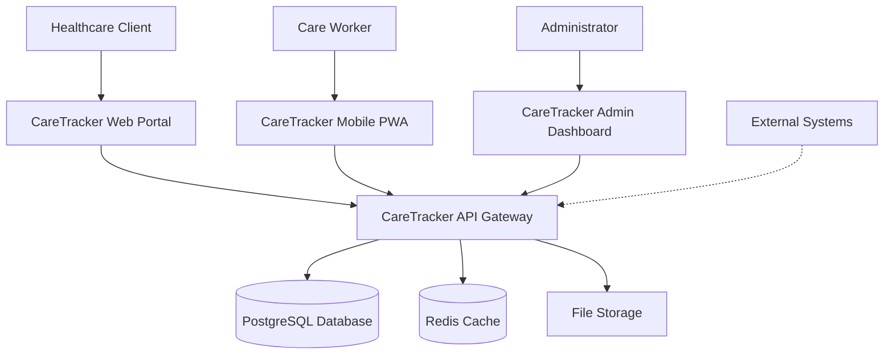
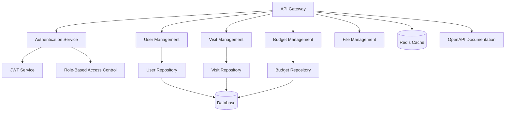
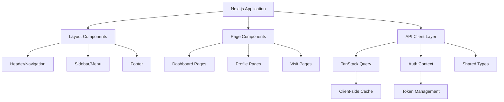
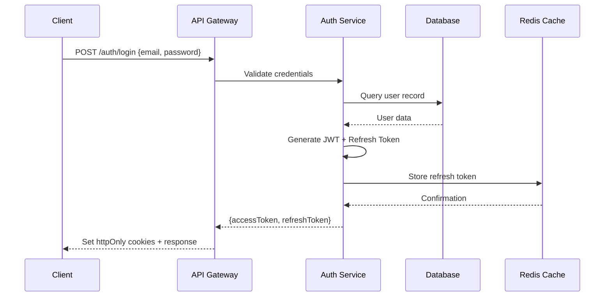
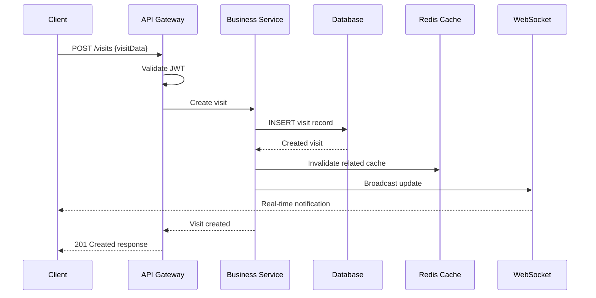
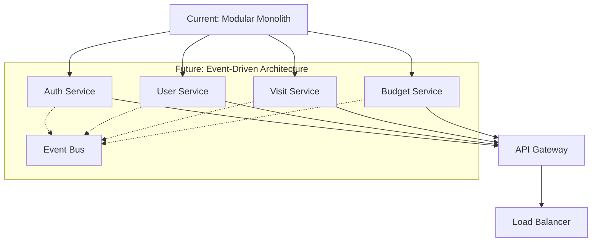

# CareTracker System Architecture

**Document Version**: 1.0
**Last Updated**: 2025-09-18
**Status**: Active
**Related ADRs**: [0001-api-framework-selection](../architecture/decisions/0001-api-framework-selection.md), [0002-frontend-state-management](../architecture/decisions/0002-frontend-state-management.md), [0003-authentication-architecture](../architecture/decisions/0003-authentication-architecture.md), [0004-database-access-patterns](../architecture/decisions/0004-database-access-patterns.md), [0005-testing-strategy](../architecture/decisions/0005-testing-strategy.md)

## Architecture Overview

CareTracker follows a modern monorepo architecture with clean separation of concerns, optimized for developer productivity and healthcare compliance requirements. The system employs a microservices-ready design while maintaining deployment simplicity through container orchestration.

## System Context (C4 Level 1)



## Container Diagram (C4 Level 2)

### Frontend Applications
- **Web Portal** (port 3000): Client-facing Next.js 14 application
- **Mobile PWA** (port 3001): Care worker Progressive Web App
- **Admin Dashboard** (port 3002): Administrative interface

### Backend Services
- **API Gateway** (port 3001): Fastify-based REST API with authentication
- **Database Service**: PostgreSQL with Prisma ORM
- **Cache Service**: Redis for session management and performance
- **File Service**: Local file storage with upload capabilities

## Technology Stack Architecture

### Frontend Layer (2025 Standards)
```typescript
// Technology Stack
{
  "framework": "Next.js 14.1.0",
  "runtime": "React 18.2.0",
  "language": "TypeScript 5.3.3",
  "styling": "Tailwind CSS + shadcn/ui",
  "stateManagement": "TanStack Query + Zustand",
  "forms": "React Hook Form + Zod",
  "testing": "Vitest + React Testing Library + Playwright",
  "build": "Turbo + SWC",
  "pwa": "Next.js PWA plugin"
}
```

### Backend Layer
```typescript
// Technology Stack
{
  "runtime": "Node.js 20+ LTS",
  "framework": "Fastify 4.25.2",
  "language": "TypeScript 5.3.3",
  "orm": "Prisma 5.8.1",
  "validation": "Zod 3.22.4",
  "authentication": "JWT + Refresh Tokens",
  "documentation": "OpenAPI 3.0 + Swagger UI",
  "security": "Helmet + CORS + Rate Limiting",
  "testing": "Vitest + Testcontainers + Supertest"
}
```

### Infrastructure Layer
```yaml
# Infrastructure Stack
Platform: "MacBook Pro M1 (ARM64 optimized)"
Containerization: "Docker Desktop for Apple Silicon"
Database: "PostgreSQL 15 (ARM64 native)"
Cache: "Redis 7 Alpine (ARM64 native)"
Monitoring: "Docker Stats + System Monitoring"
PublicAccess: "Cloudflare Tunnel (free tier)"
CI/CD: "GitHub Actions (2000 min/month)"
```

## Monorepo Structure

```
caretracker/
├── apps/                           # Application packages
│   ├── web/                       # Next.js client portal
│   ├── mobile-web/                # PWA for care workers
│   └── admin/                     # Admin dashboard
├── packages/                      # Shared packages
│   ├── api/                       # Fastify backend service
│   ├── database/                  # Prisma schemas & migrations
│   ├── shared/                    # Shared types & utilities
│   └── ui/                        # Shared UI components
├── tooling/                       # Development tooling
│   ├── eslint/                    # ESLint configurations
│   └── typescript/                # TypeScript configurations
├── docs/                          # Documentation
│   ├── specifications/            # Technical specifications
│   ├── architecture/decisions/    # Architecture Decision Records
│   └── standards/                 # Coding standards
├── tests/                         # End-to-end tests
├── infrastructure/                # Deployment configurations
└── scripts/                       # Build & deployment scripts
```

## Component Architecture (C4 Level 3)

### API Gateway Components


### Frontend Application Components


## Data Flow Architecture

### Authentication Flow


### Data Mutation Flow


## Security Architecture

### Authentication & Authorization
```typescript
// JWT Payload Structure
interface JWTPayload {
  readonly userId: string;
  readonly role: 'CLIENT' | 'WORKER' | 'ADMIN' | 'SUPERVISOR';
  readonly permissions: readonly string[];
  readonly organizationId: string;
  readonly iat: number;
  readonly exp: number;
}

// Role-Based Access Control
const permissions = {
  CLIENT: ['visits:read', 'profile:update', 'budget:read'],
  WORKER: ['visits:read', 'visits:update', 'clients:read'],
  ADMIN: ['*:*'], // Full access
  SUPERVISOR: ['workers:manage', 'reports:read']
} as const;
```

### Data Protection Layers
1. **Transport Security**: HTTPS/TLS 1.3 encryption
2. **Application Security**: JWT with refresh token rotation
3. **Database Security**: Row-level security and encryption at rest
4. **API Security**: Rate limiting, CORS, and CSP headers
5. **Audit Security**: Comprehensive activity logging

## Performance Architecture

### Caching Strategy
```typescript
// Multi-level Caching Architecture
interface CacheStrategy {
  // Level 1: Browser Cache
  browserCache: {
    staticAssets: '1 year',
    apiResponses: '5 minutes',
    userPreferences: 'session'
  };

  // Level 2: CDN Cache (Cloudflare)
  cdnCache: {
    staticContent: '24 hours',
    apiResponses: '1 minute',
    images: '7 days'
  };

  // Level 3: Redis Cache
  redisCache: {
    userSessions: '24 hours',
    queryResults: '15 minutes',
    rateLimit: '1 hour'
  };

  // Level 4: Database Query Cache
  dbCache: {
    queryPlan: 'automatic',
    resultSet: '5 minutes',
    preparedStatements: 'connection'
  };
}
```

### Database Optimization
```sql
-- Performance Indexes
CREATE INDEX CONCURRENTLY idx_users_email_active ON users(email, is_active);
CREATE INDEX CONCURRENTLY idx_visits_client_scheduled ON visits(client_id, scheduled_at);
CREATE INDEX CONCURRENTLY idx_visits_worker_status ON visits(worker_id, status);

-- Partial Indexes for Common Queries
CREATE INDEX CONCURRENTLY idx_visits_active
ON visits(scheduled_at) WHERE status IN ('SCHEDULED', 'CONFIRMED');

-- Full-text Search Index
CREATE INDEX CONCURRENTLY idx_visits_search
ON visits USING gin(to_tsvector('english', notes));
```

## Scalability Architecture

### Horizontal Scaling Patterns
```yaml
# Scaling Strategy
LoadBalancer:
  Type: "Nginx (future)"
  Strategy: "Round-robin with health checks"

ApplicationLayer:
  Scaling: "Multiple Node.js instances"
  SessionStore: "Redis (shared state)"
  FileStorage: "Distributed storage (future)"

DatabaseLayer:
  ReadReplicas: "PostgreSQL streaming replication"
  ConnectionPooling: "PgBouncer"
  Partitioning: "Time-based partitions for visits"

CacheLayer:
  RedisCluster: "Master-slave configuration"
  Eviction: "LRU with TTL policies"
```

### Microservices Evolution Path


## Deployment Architecture

### MacBook Pro M1 Optimization
```dockerfile
# ARM64 Native Containers
FROM node:20-alpine3.18
# Leverages Apple Silicon performance

# Multi-stage builds for optimization
FROM postgres:15
PLATFORM linux/arm64
# Native ARM64 database performance

# Redis optimized for M1
FROM redis:7-alpine
PLATFORM linux/arm64
MEMORY_LIMIT 256mb
```

### Container Orchestration
```yaml
# docker-compose.production.yml
version: '3.8'
services:
  api:
    build:
      context: ./packages/api
      platform: linux/arm64
    deploy:
      resources:
        limits:
          memory: 512M
          cpus: '1.0'
        reservations:
          memory: 256M
          cpus: '0.5'
    healthcheck:
      test: ["CMD", "curl", "-f", "http://localhost:3001/health"]
      interval: 30s
      timeout: 10s
      retries: 3
```

## Cross-Cutting Concerns

### Error Handling Strategy
```typescript
// Standardized Error Response
interface APIError {
  readonly success: false;
  readonly error: {
    readonly code: string;
    readonly message: string;
    readonly details?: unknown;
    readonly timestamp: string;
    readonly requestId: string;
  };
}

// Error Classification
enum ErrorTypes {
  VALIDATION_ERROR = 'VALIDATION_ERROR',
  AUTHENTICATION_ERROR = 'AUTHENTICATION_ERROR',
  AUTHORIZATION_ERROR = 'AUTHORIZATION_ERROR',
  BUSINESS_LOGIC_ERROR = 'BUSINESS_LOGIC_ERROR',
  SYSTEM_ERROR = 'SYSTEM_ERROR'
}
```

### Logging & Monitoring
```typescript
// Structured Logging
interface LogEntry {
  readonly timestamp: string;
  readonly level: 'debug' | 'info' | 'warn' | 'error';
  readonly service: string;
  readonly requestId: string;
  readonly userId?: string;
  readonly message: string;
  readonly metadata?: Record<string, unknown>;
}

// Health Check Endpoints
interface HealthCheck {
  readonly status: 'healthy' | 'degraded' | 'unhealthy';
  readonly timestamp: string;
  readonly services: {
    readonly database: 'healthy' | 'unhealthy';
    readonly cache: 'healthy' | 'unhealthy';
    readonly fileStorage: 'healthy' | 'unhealthy';
  };
  readonly metrics: {
    readonly responseTime: number;
    readonly memoryUsage: number;
    readonly cpuUsage: number;
  };
}
```

## Integration Patterns

### API Design Patterns
- **RESTful Architecture**: Resource-based URLs with HTTP verbs
- **OpenAPI Specification**: Complete API documentation and validation
- **Content Negotiation**: Support for JSON and form data
- **Versioning Strategy**: Header-based API versioning
- **Rate Limiting**: Token bucket algorithm with Redis

### Real-Time Communication
```typescript
// WebSocket Event Types
interface WebSocketEvents {
  // Visit updates
  'visit:created': { visitId: string; clientId: string };
  'visit:updated': { visitId: string; status: string };
  'visit:completed': { visitId: string; duration: number };

  // User notifications
  'notification:new': { userId: string; message: string };
  'notification:read': { userId: string; notificationId: string };

  // System events
  'system:maintenance': { message: string; scheduledAt: string };
}
```

## Quality Attributes

### Reliability
- **Fault Tolerance**: Graceful degradation with circuit breaker patterns
- **Data Consistency**: ACID transactions with optimistic locking
- **Backup Strategy**: Automated database backups with point-in-time recovery

### Security
- **Defense in Depth**: Multiple security layers from transport to application
- **HIPAA Compliance**: PHI protection with audit trails
- **Vulnerability Management**: Automated security scanning in CI/CD

### Performance
- **Response Time**: <100ms for 95% of API requests
- **Throughput**: 1000+ concurrent users support
- **Resource Efficiency**: Optimized for MacBook Pro M1 hardware

---

*This architecture specification provides the technical foundation for the CareTracker system. All implementation decisions should align with the patterns and principles outlined in this document.*